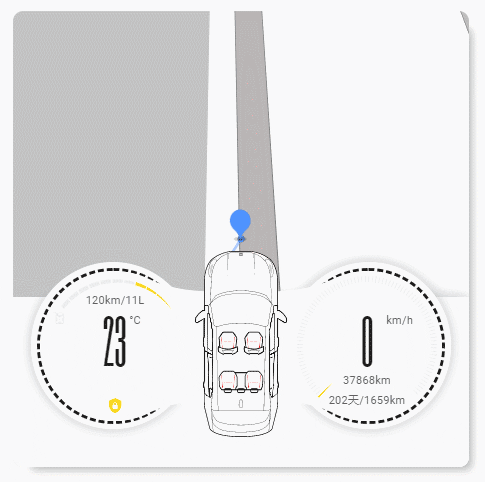

# Lovelace Car Card

[](https://github.com/custom-components/hacs)

这是适用于Lovelace的汽车仪表盘卡片,详细展示了车辆的各种状态, 以及车辆远程控制的一些交互

目前仅支持[领克汽车的HASS集成](https://github.com/fineemb/Lynk-Co)
未来如果需要可以支持任意汽车

## 更新

+ v1.0
  + 支持面板模式
  
## 预览


## HACS 安装
搜索Car Card, 或者手动添加地址安装
## 手动安装
1. 下载 `lynkco-card.js`
1. 复制到 `www\community\lovelace-car-card`
1. 在Lovelace的resources下添加以下配置
    ``` yaml
    resources:
      - url: /local/community/lovelace-car-card/lynkco-card.js
        type: module
    ```
1. 在Lovelace视图 `views.cards` 内部添加卡片配置
    ```yaml
      type: 'custom:lynkco-card'
      dark_mode: device_tracker.lykco01
      default_zoom: 20
      hours_to_show: '12'
      traffic: true
      entity: device_tracker.lykco01
      key: dfadfadffdgfgdsf
    ```

## 选项

| 属性名 | 类型 | 默认 | 描述
| ---- | ---- | ------- | -----------
| entity | entity id | **必选** | 领克集成的device_tracker
| default_zoom | Number | 选项 | 地图默认缩放等级
| traffic | boolean | 选项 | 实时路况
| hours_to_show | Number | 选项 | 指定时间内的历史路径,这里是填的是小时
| key | string | **必选** | 自己去高德申请key,内置的key说不定哪天就失效了.
